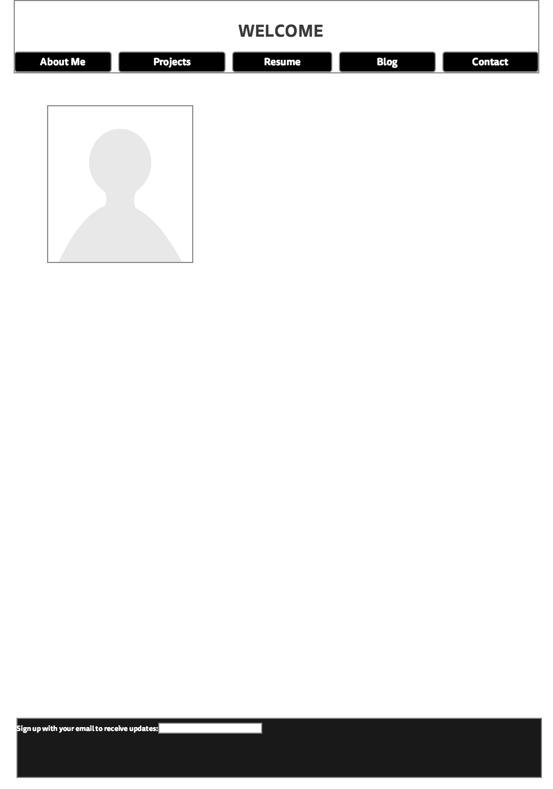
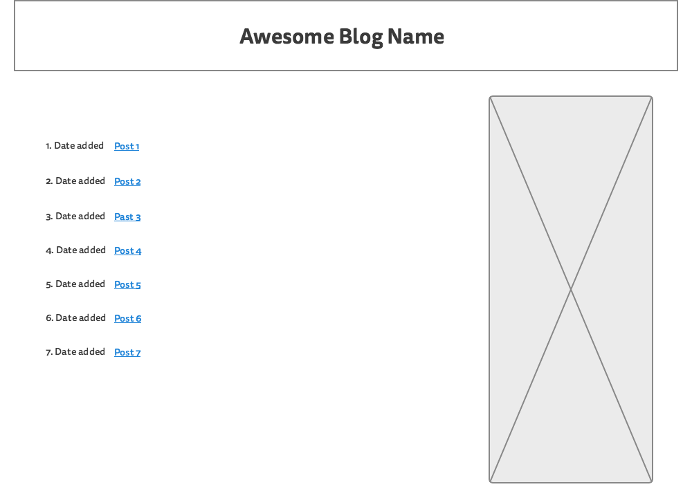

What is a wireframe?
A wireframe is a template for a webpage that uses minimalistic design to form a layout.

What are the benefits of wireframing?
It allows you to form a layout for a webpage without having to be worried about colors or other design aspects besides the layout.

Did you enjoy wireframing your site?
Not really. It wasn't something that I necessarily disliked, but I never really like to spend a lot of time on "rough drafts".

Did you revise your wireframe or stick with your first idea?
I stuck with my first idea for the most part.

What questions did you ask during this challenge? What resources did you find to help you answer them?
I didn't really have questions during this challeneg. I found it to be pretty straight forward.

Which parts of the challenge did you enjoy and which parts did you find tedious?
I found the majority of the challeneg tedious, but I did need more practice adding images inline with markdown, so this helped with that a bit.