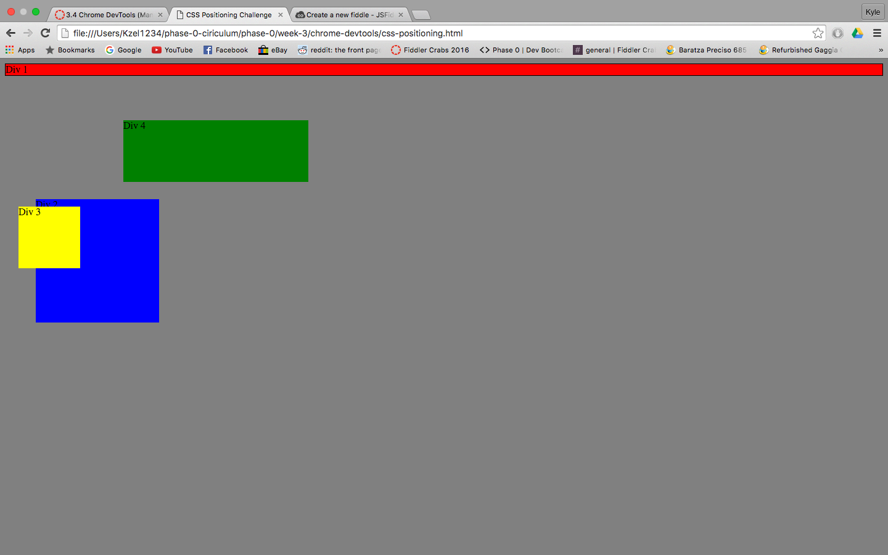
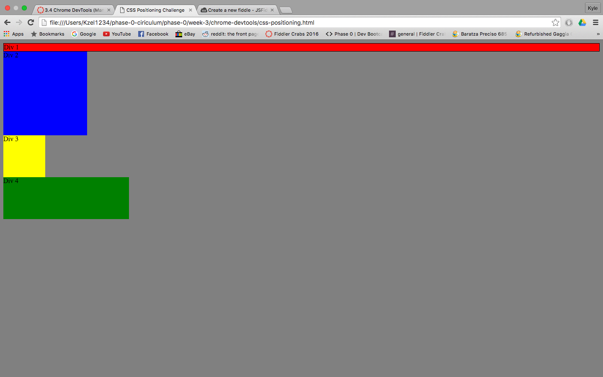
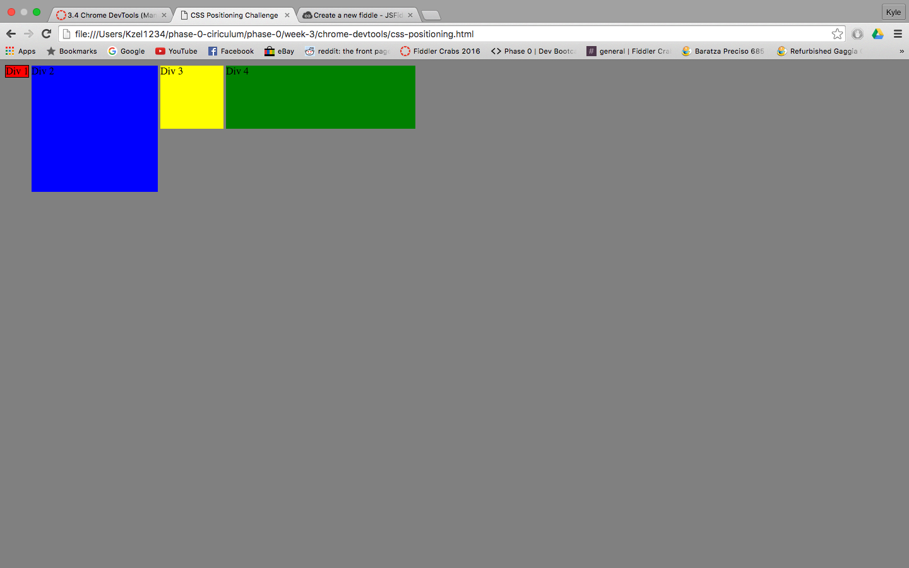
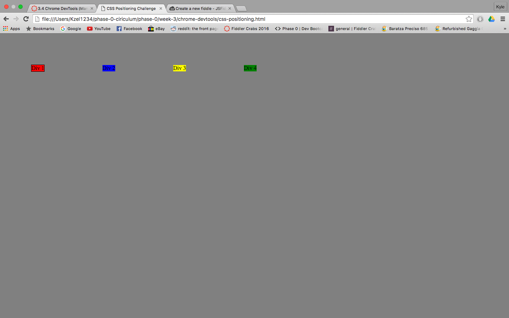
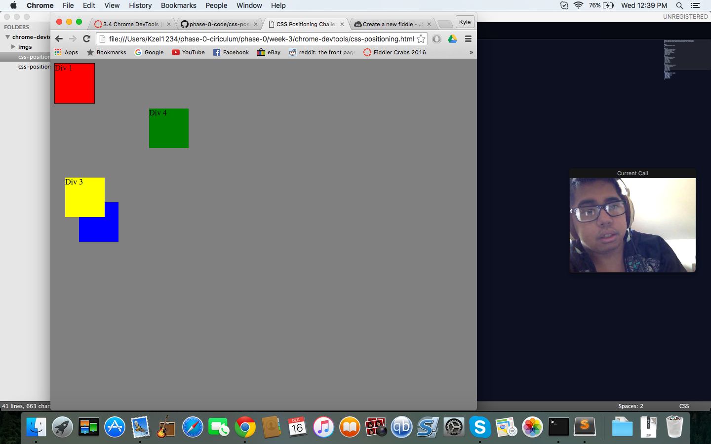
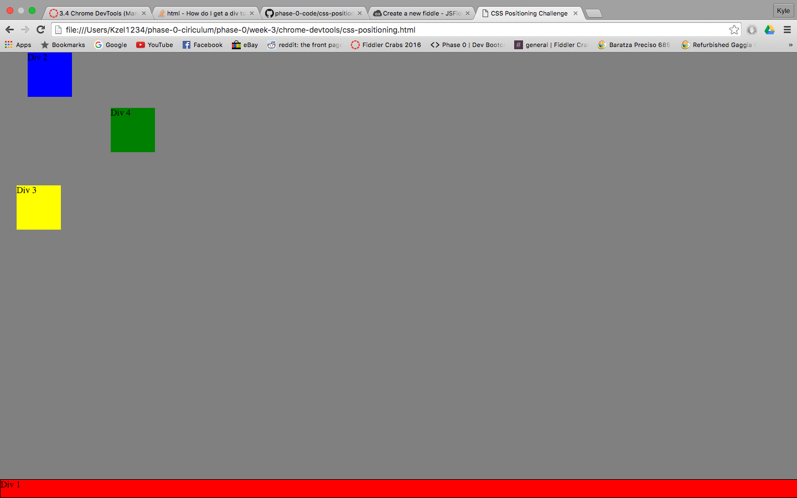
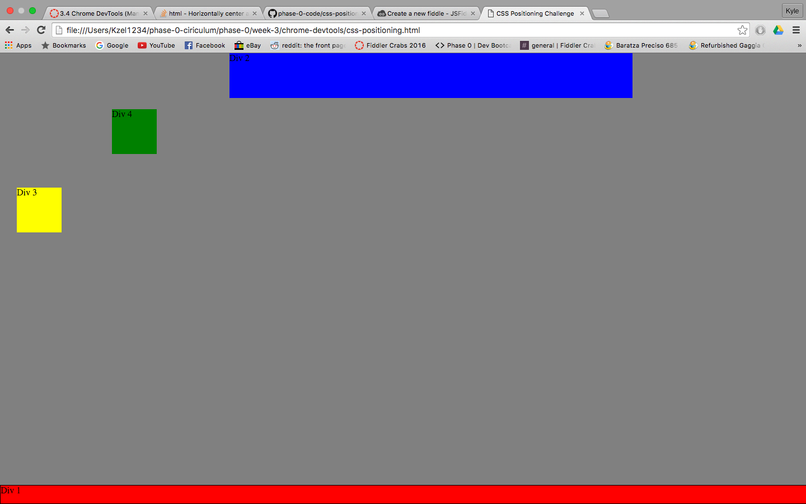
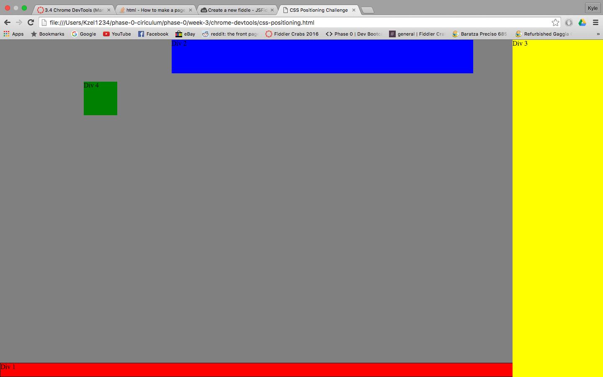
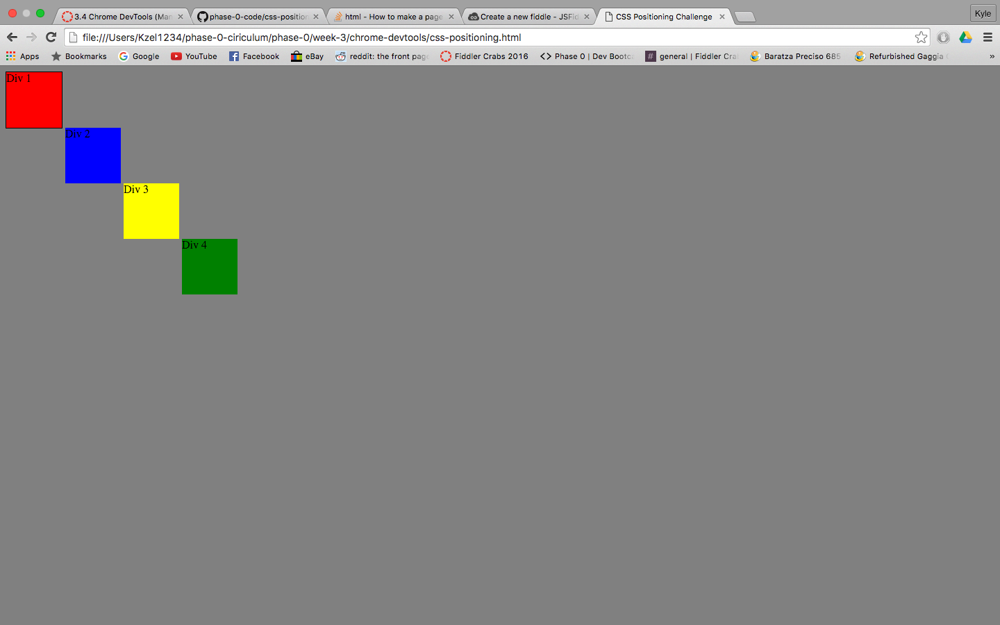

How can you use Chrome's DevTools inspector to help you format or position elements?
Chrome's Devtools inspector let's you know details about every object in a page, inlcuding its positioning.

How can you resize elements on the DOM using CSS?
You can resize elements by using the height and width selectors

What are the differences between absolute, fixed, static, and relative positioning? Which did you find easiest to use? Which was most difficult?
Static is the default, relative moves an element relative to its static position, absolute allows you to set an elements exact location, and fixed always stays in the same place withing the browser. I found relative to be the easiest and absolute to be the most dificult.

What are the differences between margin, border, and padding?
Padding is the space between an element and its border, Border is the border around an element, and margin is the space around an element.

What was your impression of this challenge overall? (love, hate, and why?)
I enjoyed this challenge because it was a great way to practice collaborative problem solving in a creative way.
